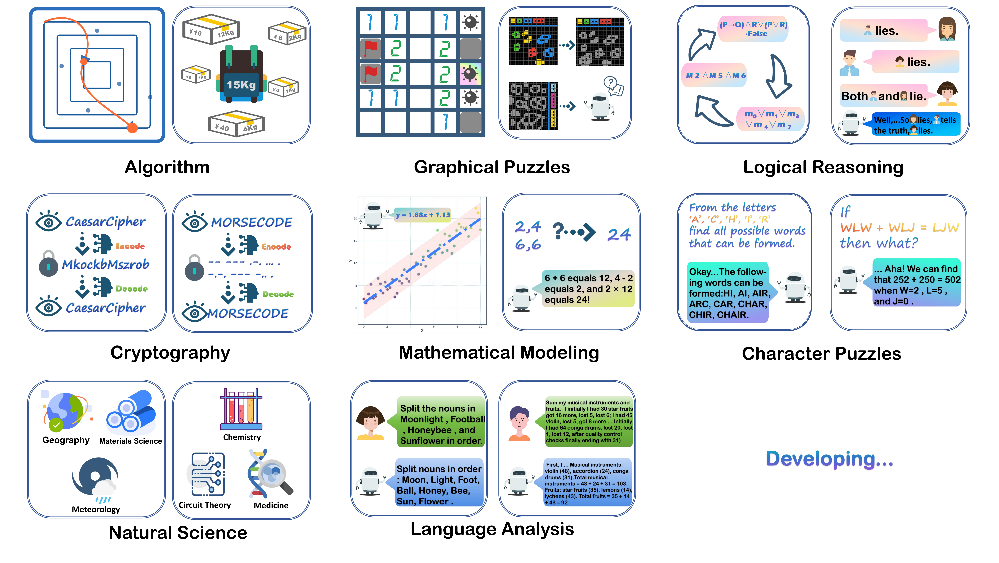
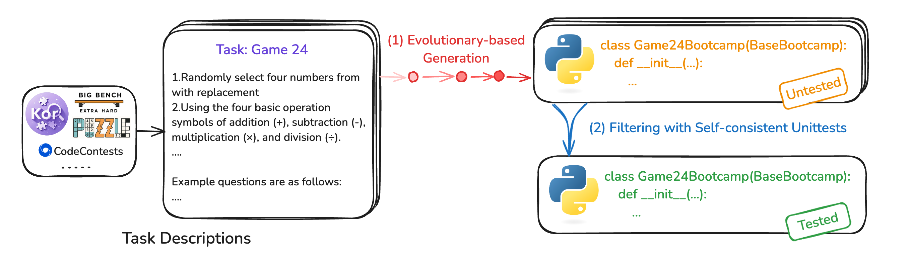
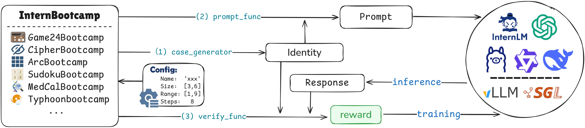
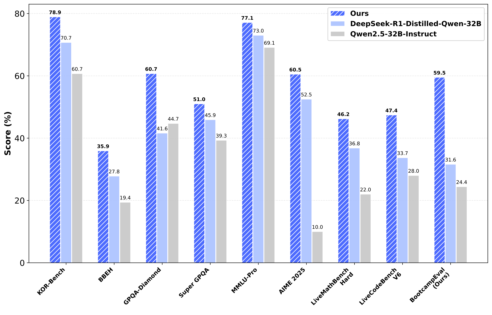
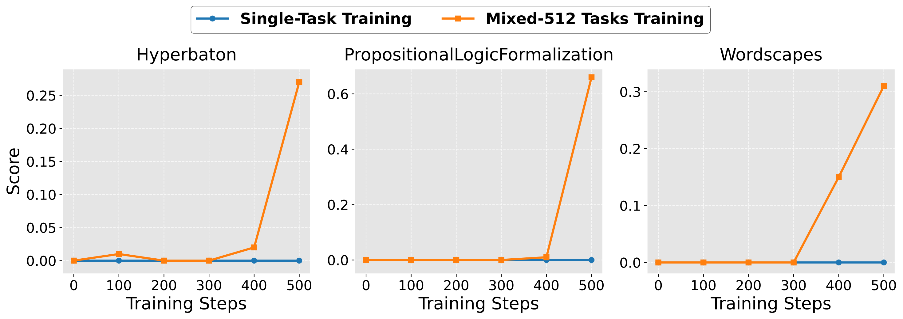
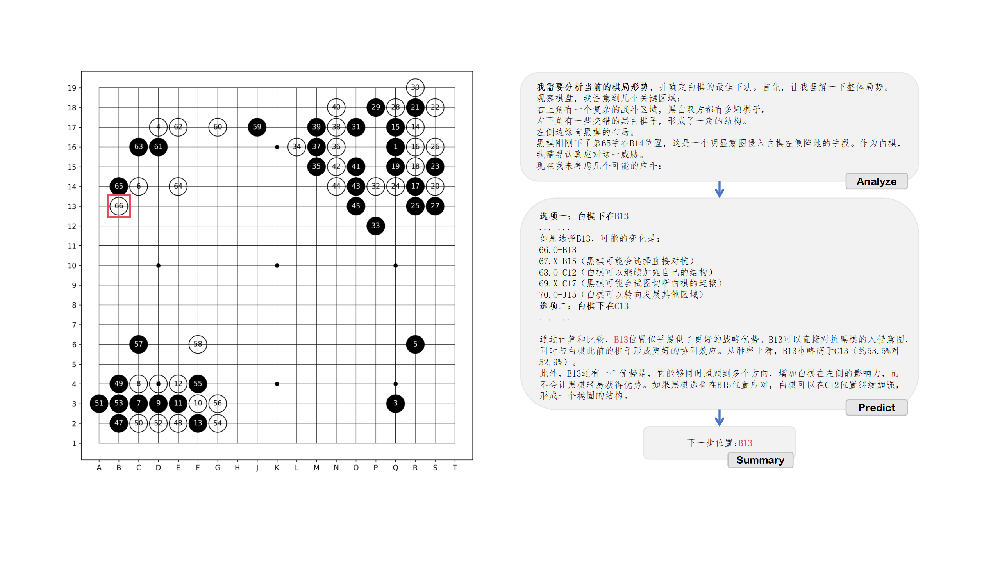

# InternBootcamp


<p align="center">
  <a href="https://arxiv.org/pdf/2508.08636">📄 Paper</a> •
  <a href="https://github.com/InternLM/InternBootcamp">⭐ Github</a> •
  <a href="examples/data/Intenbootcamp_eval">📊 Evaluation</a> • 
  <a href="https://intern.openxlab.org.cn/internthinker/go-game">⚪ Internthinker-Go</a> 
</p>


<p align="center">
🌍 <a href="./README.md">English</a> | <a href="./README_zh.md">简体中文</a>
</p>

<p align="center">
 
</p>


InternBootcamp is an open-source framework comprising **1000+ domain-diverse task environments** specifically designed for LLM reasoning research. By integrating automated generation of unlimited training/testing cases with configurable difficulty levels and integrated verification modules, InternBootcamp serves as fundamental infrastructure for **RL-based model optimization**, **synthetic data generation**, and **model evaluation**. 

Our key innovation lies in demonstrating that scaling the number of verifiable reasoning tasks during training significantly enhances both reasoning performance and training efficiency—a phenomenon we term **"Task Scaling"** 📈. Currently, InternBootcamp includes verifiable reasoning tasks across 8 diverse domains, covering problems related to algorithms, cryptography, natural science, language analysis, mathematical modeling, graphical puzzles, logical reasoning, and character puzzles. We are continuing efforts to expand its scope with the community.

## 🚀 Getting Started

Quickly get started with data generation, reinforcement learning training, model evaluation, and custom Bootcamp creation!

- [Installation](#installation)
- [Quick Start](examples/get_started.md)
- [Interfaces and Usages](#usage)
- [Bootcamp-Eval Dataset](#examples/data/Intenbootcamp_eval)

## 📢 Update

- 📦 **[2025/08] v1.0 released!**
- 📄 **[2025/08] [InternBootcamp Technical Report: Boosting LLM Reasoning with Verifiable Task Scaling](https://arxiv.org/pdf/2508.08636) released.**
- 🌱 **[2025/04] v0.1 released.**


## 🧩 About

Large-scale reinforcement learning has been demonstrated to be an effective way towards expert-level reasoning models. Most current efforts to advance this technical routine concentrate on limited tasks, such as math, and focus on devising improved training algorithms. Complementary, we believe the investigation into **Task Scaling**—exposing models to a wide and growing spectrum of reasoning tasks—is essential for building general and robust reasoning models:

- Including more types of tasks covers diverse reasoning patterns, leading to more general intelligence;
- Studying tasks with controllable difficulties and their combinations facilitates understanding of training dynamics and enables more efficient training strategies.

Despite the abundance of potentially valuable tasks available, their dispersed distribution across various sources makes it exceptionally difficult for practitioners to utilize them. To this end, we introduce InternBootcamp to facilitate related investigations and provide engineering convenience. In particular, we would like to highlight the following features of InternBootcamp:

- **🔧 Standardized:** InternBootcamp provides a unified interface for various tasks and is easy to integrate with different codebases for reinforcement learning or synthetic data. Each bootcamp class implements standardized methods to generate questions and verify solutions, allowing seamless integration with reinforcement learning or synthetic data pipelines.

- **📊 Scalable:** Thanks to an automatic agent workflow for bootcamp synthesis, InternBootcamp has grown to include a large volume of diverse bootcamp tasks. In the first release, it covers over 1000 complex reasoning tasks across 8 domains, including games, logic problems, puzzles, algorithms, scientific reasoning, and more. Over 90% of these bootcamps were developed through an automated synthesis and quality filtration pipeline, enabling continuous scaling of bootcamp environments with minimal human intervention.

- **🧱 Extensible:** InternBootcamp can be extended to support more diverse and complicated tasks (e.g., tasks with multi-turn interaction like Go and agent-based environments) and provide them with question generation and results verification. Representatively, we include `InternGObootcamp` as a demonstration.

We also conduct a series of investigations into reinforcement learning using InternBootcamp. Our preliminary findings are as follows:

- **Scalable task synthesis enables broad experiential learning**: Our automated agent workflow demonstrates that large-scale, diverse reasoning environments can be effectively synthesized via iterative, evolutionary methods, opening the door to training agents on a continuous stream of novel tasks.

- **Generalization emerges from cross-task exposure**: LLMs develop stronger reasoning generalization and emergent abilities not through deep specialization in narrow domains, but by learning across a wide spectrum of reasoning tasks.

- **Task scaling improves both performance and efficiency**: Increasing the number of training tasks significantly boosts both final performance and learning efficiency, with a near-linear relationship between task quantity and reasoning capability.

- **InternThinker-GO**: As a representative of single-task training, we train `InternThinker-GO` with the InternGObootcamp. `InternThinker-GO` approaches professional players using far fewer games than AlphaGO, surpassing current reasoning models. Besides excellent performance, `InternThinker-GO` provides reasonable and inspiring thoughts, demonstrating the great potential of human-like reasoning empowered by reinforcement learning in tackling expert-level tasks.

## 🎯 Supported Bootcamps

<p align="center">
   
</p>

In the first release, InternBootcamp has covered bootcamps for **1000+ tasks**, coming from:

- **🧠 Benchmarks for reasoning:** Currently, we have included tasks from [ARC-AGI](https://github.com/fchollet/ARC-AGI), [re-arc](https://github.com/michaelhodel/re-arc), [KOR-Bench](https://kor-bench.github.io/), and [BBEH](https://github.com/google-deepmind/bbeh), three representative reasoning benchmarks, to build bootcamps. Here, KOR-Bench includes five types of reasoning tasks, namely logic, operation, cipher, puzzle, and counterfactual reasoning, where we neglect counterfactual reasoning for its dependence on specific world-view knowledge and build bootcamps for the remaining four types of tasks. BBEH is 23 reasoning tasks obtained by complicating tasks from BBH, and we build bootcamps for tasks that do not depend on external knowledge.

- **🧩 Puzzle websites:** [puzzle-xxx](https://www.puzzle-aquarium.com/) is a series of webpages of puzzles; we scratch 39 puzzles on it to prepare corresponding bootcamps.

- **⚙️ Algorithm problems:** Algorithm problems cover reasoning patterns in various algorithms, and they contain questions that are close to real-world applications. Meanwhile, algorithm problems in the wild usually contain reference solutions, making it easy to convert them into bootcamps. Currently, we use [CodeContests](https://huggingface.co/datasets/deepmind/code_contests) and select 1265 tasks with medium difficulties (codeforces points between 1000 and 2000) and apply our automatic workflow to construct corresponding bootcamps. Additionally, we adapted tasks from [CodeIO](https://codei-o.github.io/), which translates code-based reasoning into natural language to assess large language models' reasoning capabilities.

- **💻 Benchmarks for programming capability:** Currently, we have included tasks from [BigCodeBench](https://bigcode-bench.github.io/) and [KodCode](https://kodcode-ai.github.io/), two representative programming benchmarks, to build bootcamps. These benchmarks feature diverse and challenging problems that require language models to generate correct code. For each task, we collected or adapted a `unittest` script to validate solution correctness.

- **📋 Instruction following:** These tasks test a model's ability to comprehend and strictly adhere to instructions embedded in task descriptions. In many cases, correctness can be evaluated through code execution feedback. We included tasks from [AutoIF](https://github.com/QwenLM/AutoIF), which contains over 60,000 instruction–evaluation function pairs, each treated as an individual task.

- **🎮 Games:** Games are a kind of complex reasoning tasks involving multi-turn interactions featuring controllable and verifiable objectives. As a representative, we built `InternGObootcamp` to train a reasoning model for Go.

- **🔬 Scientific tasks:** Scientific tasks represent a spectrum of reasoning-intensive endeavors deeply intertwined with scientific research activities, which are regarded as one of the most valuable domains where AI will revolutionize. We consider that improving reasoning models on these tasks facilitates the achievement of this vision. Part of the scientific task collection is supported by the [Intern-S1](https://arxiv.org/pdf/2508.15763) team, and in return, InternBootcamp also provides training support for Intern-S1.

We are continuing our efforts and call for the community to verify the automatically generated bootcamps. We present the full list of bootcamps ([the full bootcamp list](./Fulllist_InternBootcamp.md)) and illustrate our automatic workflow below.


## 🤖 Automatic Agent Workflow for Large-Scale Bootcamp Synthesis

<p align="center">
   
</p>

Manually coding bootcamps for each task is inefficient and not scalable. We introduce an **automatic agent workflow** that leverages large language models to generate bootcamp code from task descriptions. This pipeline involves:

1. **📥 Task Description Collection:** Identify verifiable tasks (puzzles, reasoning benchmarks, algorithm problems, etc.) and collect their descriptions and supporting information.
2. **🔄 Evolutionary Code Generation:** Use strong coding models (e.g., Deepseek-R1) to generate bootcamp code iteratively, incorporating execution feedback to avoid oversimplification and errors.
3. **✅ Self-Consistent Unittest Filtering:** Filter bootcamps by evaluating LLM responses using the `verify_function` as unittests. Bootcamps with accuracy outside [0.03, 0.85] are filtered out.

This workflow has enabled rapid expansion to 1000+ bootcamps with high quality and diversity.


## 🛠 Interfaces and Usages

Each bootcamp inherits from `BaseBootcamp` and contains three main interfaces: `case_generator`, `prompt_func`, and `verify_func`, to serve for question generation and result verification.

<p align="center">
   
</p>

### Installation <a id="installation"></a>

```bash
git clone https://github.com/InternLM/InternBootcamp.git 
cd InternBootcamp
pip install -e .
```

### Example: Game24Bootcamp <a id="usage"></a>

Game24 is an arithmetic puzzle where you use `num_numbers` numbers (each ≤ `range_max`) and basic operations to obtain the `target` value (≤ `target_max`).

#### Generating Questions

```python
from internbootcamp import Game24Bootcamp

# Specify difficulty parameters
bootcamp = Game24Bootcamp(num_numbers=4, range_max=100, target_max=100, seed=42)

# Or use default configuration
# bootcamp_default = Game24Bootcamp()

identity = bootcamp.case_generator()
prompt = bootcamp.prompt_func(identity)

# Example Output:
# - identity: {'puzzle': '8 43 65 77', 'target': 28} 
# - prompt: "Please solve the puzzle: using 8 43 65 77 to obtain 28 through basic arithmetics..."
```

#### Verifying Results

```python
response = "...some reasoning process...\\boxed{77 / (65 - 43) * 8}"
score = Game24Bootcamp.verify_score(response, identity, format_score=0.1)
```

### Extending to More Tasks

New bootcamps can be created by inheriting from `BaseBootcamp` and implementing its core interfaces. See [examples/README.md](examples/README.md) for details.

### Reinforcement Learning

InternBootcamp integrates easily with RL frameworks. See [examples/README.md](examples/README.md) for details.


## 🧪 Experiments: Boosting LLM Reasoning with Verifiable Task Scaling

We conduct extensive experiments to investigate how **Task Scaling**—training with an increasing number and diversity of reasoning tasks—enhances the reasoning capabilities of large language models. Our findings demonstrate that Task Scaling not only improves final performance but also significantly boosts training efficiency.

<p align="center">
   
</p>

Through systematic scaling of training tasks, we observe consistent improvements in model performance across diverse reasoning domains. Models trained with more tasks achieve better generalization and higher accuracy on our Bootcamp-Eval benchmark, showcasing the effectiveness of Task Scaling in developing versatile reasoning models. Besides, scaling the number of training tasks also enhances training efficiency in RLVR process.

Additionally, we discover that multi-task training enables an **Emergent Moment**—where tasks that are unsolvable in isolation suddenly become learnable when trained together with other tasks. This phenomenon demonstrates that cross-task knowledge transfer fosters latent generalization capabilities, allowing models to tackle complex challenges that would otherwise remain out of reach.

<p align="center">
   
</p>

📌 For detailed experimental results and comprehensive analysis, please refer to our [technical report](https://arxiv.org/pdf/2508.08636) 📝.

## ⚫ DEMO: [InternThinker-GO](https://intern.openxlab.org.cn/internthinker/go-game)

LLMs have demonstrated remarkable performance across a wide range of common reasoning tasks. However, as one of the earliest research problems that ignited the AI boom, the reasoning capabilities of general-purpose LLMs in the specific domain of **Go** have received little research attention. While AlphaZero challenged human intelligence in the Go domain from the perspective of "Mastering the Game of Go without Human Knowledge," we explore how to bring human intelligence back to this ancient game, allowing the natural language thinking patterns unique to humans to shine again in the new context of LLMs. Based on InternBootcamp, we implemented a Go bootcamp for reinforcement learning of reasoning models, cold-started with professional Go domain data, and reinforced the model's reasoning paradigm through reinforcement learning. Our model achieves performance comparable to professional Go players - InternThinker-GO can consistently defeat Golaxy AI at amateur 6-dan level and approaches the professional 1-star level, making it the first general large language model to reach this level of performance.

<p align="center">
   
</p>

For a given state, InternThinker-GO first analyzes the situation on the board: *"There is a complex battle area in the upper right corner, where both Black and White have multiple stones. The lower left corner has some interlaced Black and White stones, forming a certain structure. Black has a formation along the left edge. Black just played move 65 at B14, which is clearly intended to invade White's territory on the left side. As White, I need to respond carefully to this threat."* Next, InternThinker-GO specifically predicts and analyzes potential moves such as B13, C13, and ultimately selects B13 as the placement position.

## 🙏 致谢

We acknowledge the following excellent projects, whose work has provided significant inspiration and tooling for our efforts:

- [Intern-S1](https://github.com/InternLM/Intern-S1)
- [VeRL](https://github.com/volcengine/verl)
- [Xtuner](https://github.com/InternLM/xtuner)
- [OpenCompass](https://github.com/open-compass/opencompass)


## 📜 Citation

If you find our work helpful, please cite:

```bibtex
@misc{li2025internbootcamptechnicalreportboosting,
      title={InternBootcamp Technical Report: Boosting LLM Reasoning with Verifiable Task Scaling}, 
      author={Peiji Li and Jiasheng Ye and Yongkang Chen and Yichuan Ma and Zijie Yu and Kedi Chen and Ganqu Cui and Haozhan Li and Jiacheng Chen and Chengqi Lyu and Wenwei Zhang and Linyang Li and Qipeng Guo and Dahua Lin and Bowen Zhou and Kai Chen},
      year={2025},
      eprint={2508.08636},
      archivePrefix={arXiv},
      primaryClass={cs.CL},
      url={https://arxiv.org/abs/2508.08636}, 
}
```
